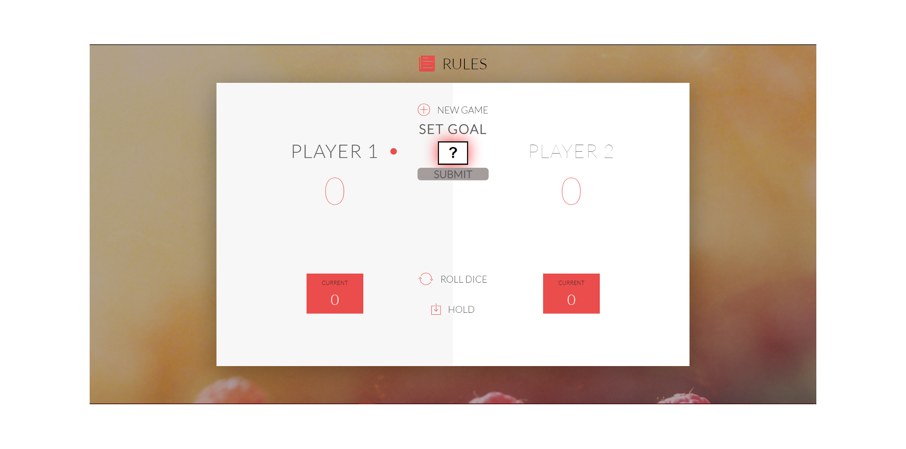

# Complete JS Course 2019

## Check Here the "Pig Game" ==> https://jakubfolta.github.io/Complete-JS-Course-2019/

## Budget App

## Technologies
* HTML5, CSS3, JavaScript

## Sources
This project was created while going through [The Complete JavaScript Course 2019: Build Real Projects!](https://www.udemy.com/the-complete-javascript-course/)

## Contact
Created by Jakub Folta [@betterlifewisdom](https://www.betterlifewisdom.com/) - feel free to contact me! 
[Facebook](https://www.facebook.com/jakub.folta.58) - or check my fb account and send me a message!
